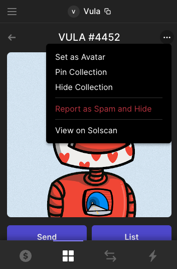
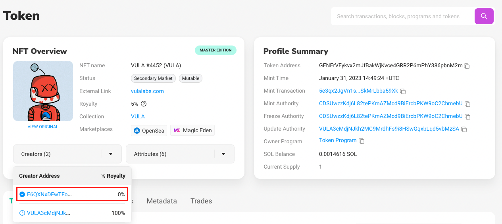
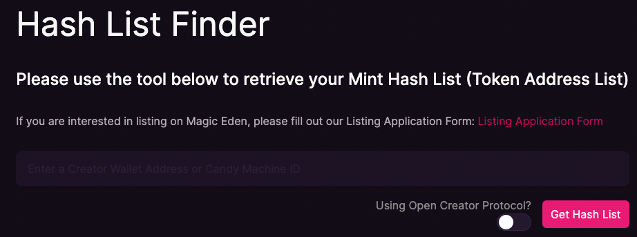

# Getting Started

This project was bootstrapped with [Create React App](https://github.com/facebook/create-react-app) and is maintained by [Vula Labs, Inc.](https://vulalabs.com) 

1. Install all dependencies by running ```npm install```
2. Run the project in your browser with ```npm start```
3. You'll be redirected to http://localhost:3000

## Obtain Hashlist

In order to get the hashlist for a Solana NFT project, you need to obtain the first creator address for your NFT collection. You can do this by viewing your NFT on [Solscan](https://solscan.io) and copy & pasting the first address listed under Creators.




Once you have the creator address go to [Magic Eden's hashlist tool](https://magiceden-io.webpkgcache.com/doc/-/s/magiceden.io/mintlist-tool) 

Copy & paste your creator address in the input field.



Allow the tool to run for a few minutes and then you will see your hashlist appear in the text box.


Select "Export Hash List"

## Retrieve Metadata

Once you have your Hashlist, use [this tool](https://github.com/vulalabs/metadata-from-hashlist) to get the metadata for each NFT.

## Import Metadata

Now you should have a ```data.json ``` and ```rarity.json``` file after using the previous tool. Copy and paste those into ```./src```.

## Support

We're happy to help out if you have any questions. Reach out to [Obes](https://twitter.com/obestheone)

### P.S.

Also check out our [Free Discord Bot](https://clubpoints.app) to give your community NFT Holder roles